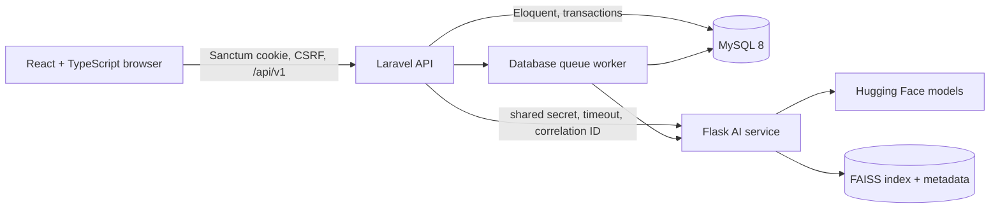
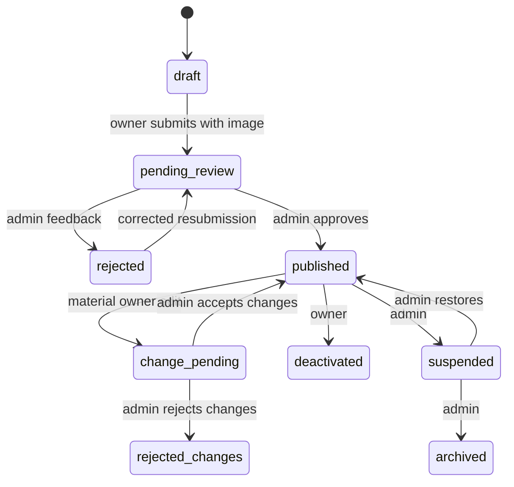

# Architecture and request flow

## Runtime tiers

The browser never knows the AI URL or secret. Laravel selects only published/available records and applies price, location, gender, facilities and other hard filters before internal ranking. MySQL remains authoritative if FAISS is unavailable.

## Key flows

### Search

1. React preserves filters in the URL and calls `GET /api/v1/search`.
2. Laravel validates all operators and builds an eligible Eloquent collection capped at 500.
3. With natural text, Laravel sends canonical public text to Flask with a deadline and shared secret.
4. Base/production mode embeds the eligible set and ranks with cosine similarity using `faiss.IndexFlatIP`; fixture mode uses deterministic TF-IDF.
5. Laravel paginates returned IDs, records sanitized search metrics and exposes a warning when keyword fallback was used.

### Listing publication

The workflow transaction updates the listing, appends status history and writes an admin audit event. Publication stays successful even if asynchronous indexing fails: the index record becomes `error` and the job is retryable. Matching saved-search notifications are deduplicated by listing link.

### Reviews

A tenant upserts one review per listing. Laravel recalculates the visible aggregate and commits before queuing AI analysis. Flask classifies sentiment and extracts evidence-bound aspects; the displayed sentence is a deterministic template, never generative text. AI failure cannot discard the review.

## Boundaries and choices

- Secure stateful browser auth: Sanctum session cookie + CSRF; admin accounts are seeded/CLI provisioned only.
- Plain text: React escapes descriptions, messages and reviews; there is no rich HTML input path.
- Location privacy: public area and approximate coordinates are serialized; private street address is not in `ListingResource`.
- Map abstraction: Leaflet/OpenStreetMap is the no-key implementation. Coordinates remain provider-independent, so a restricted Google Maps adapter can replace it.
- Queues: database-backed for portability; jobs cover review AI, index synchronization and matching notifications.
- Money: integer LKR, never floating point.
- Time: framework UTC storage; UI explicitly renders `Asia/Colombo`.

## Observability

Laravel logs normal framework request failures, sends correlation IDs to Flask and exposes health endpoints. Flask logs endpoint, method, status, latency, safe correlation ID and model versions—not request text or secrets. Admin analytics are query-backed and message contents are excluded.
