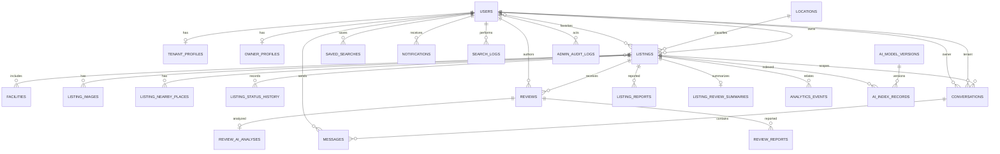

# Entity relationship diagram

Foreign-key deletion behavior is deliberate: profile/favorite/message-support tables cascade where the parent cannot sensibly exist; audit actors and conversation/listing relationships restrict destructive deletion; user/listing records use soft deletion where historical accountability matters.
